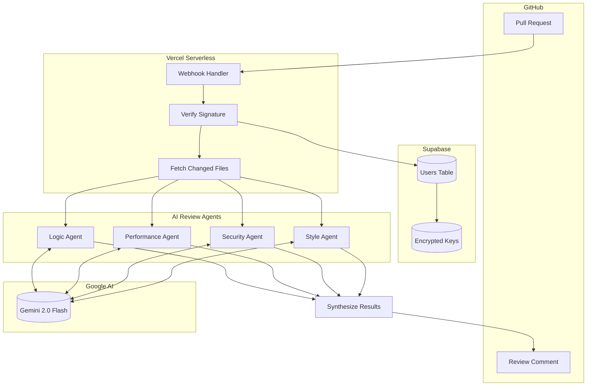
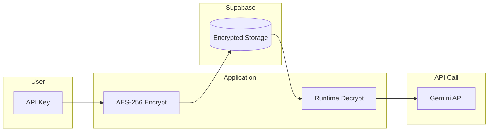

<p align="center">
  
</p>

<h1 align="center">AI Code Review Automation</h1>

<p align="center">
  <strong>Automated pull request reviews powered by Google Gemini AI</strong>
</p>

<p align="center">
  <a href="#features">Features</a> •
  <a href="#quick-start">Quick Start</a> •
  <a href="#installation">Installation</a> •
  <a href="#how-it-works">How It Works</a> •
  <a href="#configuration">Configuration</a> •
  <a href="#deployment">Deployment</a> •
  <a href="#contributing">Contributing</a>
</p>

<p align="center">
  
  
  
  
</p>

---

## 🎯 What is this?

**AI Code Review Automation** is a GitHub App that automatically reviews your pull requests using **4 specialized AI agents**. Each agent focuses on a specific aspect of code quality, providing comprehensive feedback that helps catch issues before they reach production.

> **BYO API Key** — Users bring their own Google Gemini API key. No subscription required, pay only for what you use.

---

## ✨ Features

<table>
  <tr>
    <td width="50%">
      <h3>🎨 Style Agent</h3>
      <p>Analyzes naming conventions, code formatting, organization, and adherence to language-specific best practices.</p>
    </td>
    <td width="50%">
      <h3>🔒 Security Agent</h3>
      <p>Detects vulnerabilities, hardcoded secrets, SQL injection risks, XSS vectors, and authentication issues.</p>
    </td>
  </tr>
  <tr>
    <td width="50%">
      <h3>⚡ Performance Agent</h3>
      <p>Identifies algorithmic complexity issues, memory leaks, N+1 queries, and optimization opportunities.</p>
    </td>
    <td width="50%">
      <h3>🧠 Logic Agent</h3>
      <p>Catches potential bugs, edge cases, race conditions, and error handling problems.</p>
    </td>
  </tr>
</table>

### Additional Highlights

- 🚀 **One-click Installation** — Install from GitHub Marketplace in seconds
- ⚙️ **Configurable** — Enable or disable individual agents per repository
- 🔐 **Secure** — API keys are encrypted with AES-256 before storage
- 🌐 **Multi-language** — Supports Python, JavaScript, TypeScript, Go, Rust, Java, and more

---

## 🎥 Demo

See the AI Code Review in action — watch how the bot automatically reviews a pull request:

https://github.com/user-attachments/assets/da426b57-d1fb-42c3-93cd-db7c883e0a28

<details>
<summary>What happens in the demo?</summary>

1. A pull request is created with code containing issues
2. The GitHub App automatically triggers
3. All 4 AI agents analyze the code in parallel
4. A comprehensive review comment is posted with:
   - 🔒 Security vulnerabilities (hardcoded secrets, SQL injection)
   - ⚡ Performance issues (O(n²) complexity, N+1 queries)
   - 🎨 Style problems (naming conventions)
   - 🧠 Logic bugs (missing error handling)

</details>

---

## 🚀 Quick Start

### Local Testing (No GitHub App Required)

Test the AI review agents on any file locally in under 5 minutes:

```bash
# Clone the repository
git clone https://github.com/yourusername/ai-code-review-automation.git
cd ai-code-review-automation

# Set up virtual environment
python -m venv venv
source venv/bin/activate  # On Windows: venv\Scripts\activate
pip install -r requirements.txt

# Set your Gemini API key (get free at https://aistudio.google.com/apikey)
export GEMINI_API_KEY="your-api-key-here"

# Run a review on the sample file
python test_local.py test_samples/sample_code.py
```

### Example Output

```
🔍 Reviewing: test_samples/sample_code.py

🔒 Security Agent
├─ [HIGH] Hardcoded API key detected at line 12
├─ [MEDIUM] SQL query constructed with string formatting at line 45
└─ [LOW] Debug flag should be disabled in production at line 3

⚡ Performance Agent
├─ [MEDIUM] Nested loops creating O(n²) complexity at line 28
└─ [LOW] Consider using list comprehension at line 15

🎨 Style Agent
└─ [INFO] Function 'getData' should use snake_case at line 8

Total: 6 issues found
```

---

## 📦 Installation

### As a GitHub App

1. Visit the app page on GitHub Marketplace
2. Click **Install** and select your repositories
3. After installation, you'll be redirected to configure your Gemini API key
4. Open a pull request — the AI will automatically review it!

### Self-Hosted Deployment

See the [Deployment](#deployment) section for full self-hosting instructions.

---

## 🏗️ Architecture

### System Overview



### Data Flow

| Step | Component | Description |
|:----:|-----------|-------------|
| 1️⃣ | **GitHub** | PR is opened or updated, triggering a webhook |
| 2️⃣ | **Webhook Handler** | Verifies GitHub signature, authenticates request |
| 3️⃣ | **Supabase** | Retrieves user's encrypted Gemini API key |
| 4️⃣ | **GitHub API** | Fetches the actual code diff and changed files |
| 5️⃣ | **4 AI Agents** | Run in parallel, each analyzing for specific issues |
| 6️⃣ | **Gemini 2.0** | Processes code with specialized prompts per agent |
| 7️⃣ | **Synthesizer** | Combines results, removes duplicates, formats markdown |
| 8️⃣ | **GitHub API** | Posts the review as a PR comment |

### Security Architecture



> **Your API key never touches our servers in plain text.** It's encrypted before storage and only decrypted in memory during the review process.

---

## ⚙️ Configuration

After installing the app, you can configure:

| Setting | Description | Default |
|---------|-------------|---------|
| **API Key** | Your Google Gemini API key (encrypted) | Required |
| **Style Agent** | Enable code style analysis | ✅ Enabled |
| **Security Agent** | Enable security vulnerability detection | ✅ Enabled |
| **Performance Agent** | Enable performance issue detection | ✅ Enabled |
| **Logic Agent** | Enable bug and logic error detection | ✅ Enabled |

Configuration is stored encrypted in Supabase and can be updated anytime.

---

## 🚀 Deployment

### Prerequisites

- [Supabase](https://supabase.com) account (free tier works)
- [Vercel](https://vercel.com) account (free tier works)
- [Google AI Studio](https://aistudio.google.com) API key

### Step 1: Database Setup (Supabase)

1. Create a new Supabase project
2. Run the schema from `db/schema.sql` in the SQL Editor
3. Copy your project URL and service key

### Step 2: Create GitHub App

1. Go to **GitHub Settings** → **Developer Settings** → **GitHub Apps**
2. Create a new app with:
   - **Webhook URL**: `https://your-app.vercel.app/api/webhook`
   - **Permissions**: Pull requests (Read & Write), Contents (Read)
   - **Events**: Pull request
3. Generate and download the private key
4. Note your App ID and create a webhook secret

### Step 3: Deploy to Vercel

```bash
# Install Vercel CLI
npm i -g vercel

# Deploy
vercel

# Set environment variables
vercel env add GITHUB_APP_ID
vercel env add GITHUB_PRIVATE_KEY
vercel env add GITHUB_WEBHOOK_SECRET
vercel env add SUPABASE_URL
vercel env add SUPABASE_SERVICE_KEY
vercel env add ENCRYPTION_KEY
```

### Environment Variables Reference

| Variable | Description |
|----------|-------------|
| `GITHUB_APP_ID` | Your GitHub App ID |
| `GITHUB_PRIVATE_KEY` | GitHub App private key (PEM format) |
| `GITHUB_WEBHOOK_SECRET` | Secret for webhook signature verification |
| `SUPABASE_URL` | Your Supabase project URL |
| `SUPABASE_SERVICE_KEY` | Supabase service role key |
| `ENCRYPTION_KEY` | 32-byte key for encrypting user API keys |

<details>
<summary>Generate Encryption Key</summary>

```python
from cryptography.fernet import Fernet
print(Fernet.generate_key().decode())
```

</details>

---

## 📁 Project Structure

```
ai-code-review-automation/
├── api/                      # Vercel serverless functions
│   ├── webhook.py           # GitHub webhook handler
│   ├── install.py           # Installation callback
│   └── config.py            # User configuration API
├── agents/                   # AI review agents
│   ├── base.py              # Base agent class
│   ├── style_agent.py       # Code style analysis
│   ├── security_agent.py    # Security vulnerability detection
│   ├── performance_agent.py # Performance issue detection
│   └── logic_agent.py       # Bug and logic detection
├── github/                   # GitHub integration
│   ├── client.py            # GitHub App client
│   └── webhook_handler.py   # Webhook parser
├── db/                       # Database
│   ├── schema.sql           # Supabase schema
│   └── client.py            # Database client
├── public/                   # Frontend assets
│   ├── index.html           # Landing page
│   └── config.html          # Configuration UI
├── test_samples/             # Test files with intentional issues
├── test_local.py            # Local testing CLI
└── requirements.txt
```

---

## 🤝 Contributing

Contributions are welcome! Here's how you can help:

1. **Fork** the repository
2. **Create** a feature branch (`git checkout -b feature/amazing-feature`)
3. **Commit** your changes (`git commit -m 'Add amazing feature'`)
4. **Push** to the branch (`git push origin feature/amazing-feature`)
5. **Open** a Pull Request

### Good First Issues

- Add support for additional programming languages
- Improve agent prompts for better detection
- Add more test cases to `test_samples/`
- Improve documentation

---

## 📄 License

This project is licensed under the MIT License — see the [LICENSE](LICENSE) file for details.

---

## 🔗 Links

- [Privacy Policy](PRIVACY.md)
- [Terms of Service](TERMS.md)
- [Get Gemini API Key](https://aistudio.google.com/apikey)

---

<p align="center">
  Made with ❤️ by <a href="https://github.com/yourusername">Aakash Yadav</a>
</p>
